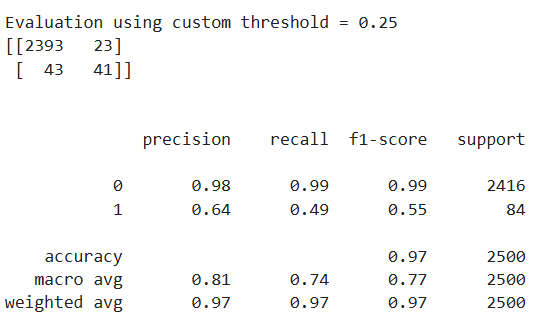
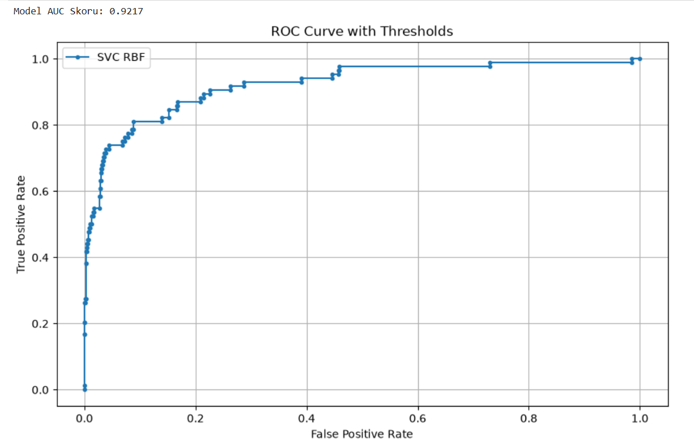
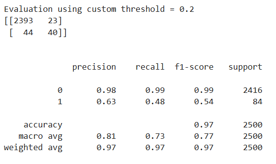
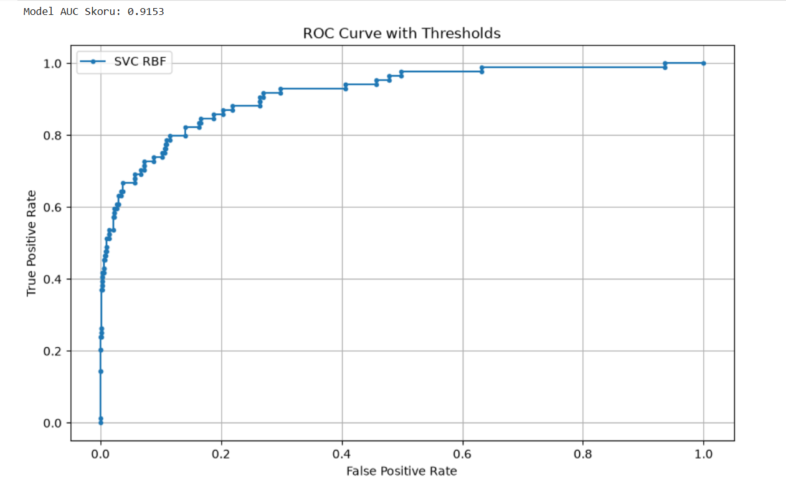
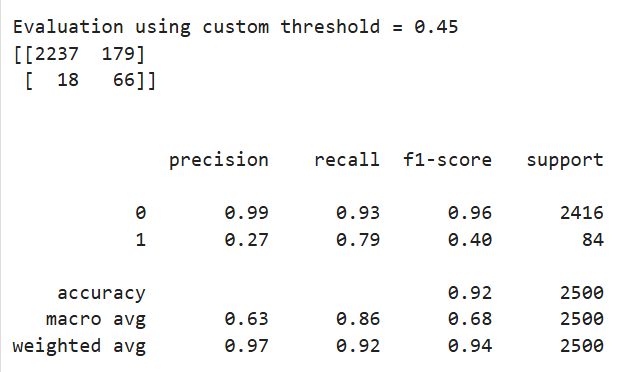
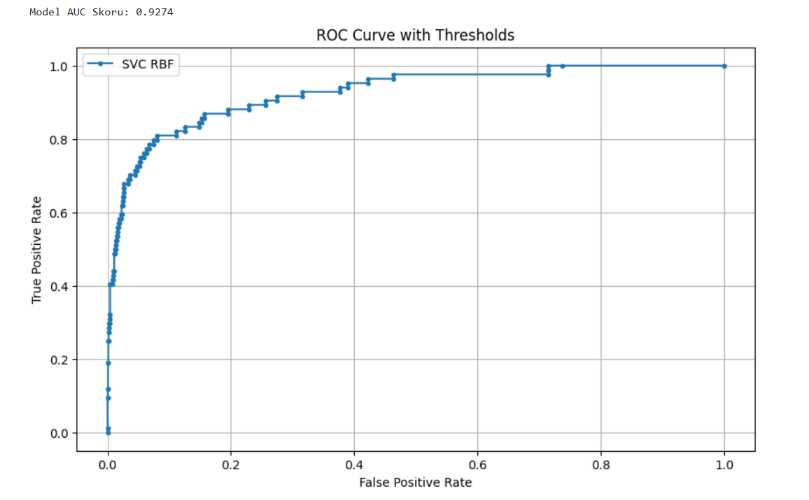

🤖 AI4I 2020 Predictive Maintenance: Model Optimization & Strategy Comparison

Bu depoda, endüstriyel üretim hatlarındaki kestirimci bakım (predictive maintenance) senaryoları için Support Vector Classifier (SVC) modeli geliştirilmiş; veri setindeki şiddetli sınıf dengesizliğini (Machine failure = 1 oranının çok düşük olması) çözmek amacıyla farklı stratejiler (Standard, Class Weight ve SMOTE) kapsamlı bir şekilde test edilip karşılaştırılmıştır.

🛠️ Kullanılan Teknolojiler

* Python 3

* Scikit-Learn & Imbalanced-Learn (SMOTE) (Modelleme, Veri Dengeleme ve Metrikler)

* Matplotlib & Seaborn (Görselleştirme)

🔬 Neden 3 Farklı Yol Denedik? (Mühendislik Yaklaşımı)

Kestirimci bakım veri setlerinde en büyük problem dengesiz veri (imbalanced data) problemidir. Sağlam makine sayısı çok fazlayken, arıza sayısı çok azdır. Modeli eğirirken tek bir stratejiye bağlı kalmak yerine şu üç farklı yaklaşım test edilmiştir:

*Standart Model (Baseline)*: Hiçbir müdahalede bulunmadan saf verilerle modelin ne tepki vereceğini görmek.

*Class Weight Optimization (Sınıf Ağırlıklandırması)*: Azınlık sınıfına (1 sınıfına) daha yüksek ceza/ağırlık vererek modelin dikkatini arızalara çekmek.

*SMOTE (Synthetic Minority Over-sampling Technique)*: Sentetik veriler üreterek azınlık sınıfını çoğunluk sınıfına eşitlemek ve modelin arızaları "öğrenmesini" zorlamak.

📊 Model Performansları ve Kıyaslama Sonuçları

1. Temel SVC Modeli (Baseline)
Standart parametrelerle kurulan temel model, çoğunluk sınıfının baskınlığı nedeniyle azınlık sınıfındaki gerçek arızaları yakalamakta zorlanmıştır.

*Confusion Matrix ve Classification Report*:

*ROC Eğrisi ve AUC*: Model 0.9217 AUC skoruna ulaşmıştır.

2. Sınıf Ağırlıklı SVC Modeli (Class Weight Optimization)
Sınıf ağırlıkları optimize edilerek yanlış alarmlar (False Positive) minimumda tutulmaya çalışılmış, bakım ekibinin iş yükü dengelenmiştir.

*Confusion Matrix ve Classification Report*:

*ROC Eğrisi ve AUC*: Model 0.9153 AUC skoru elde etmiştir.

3. SMOTE Destekli SVC Modeli
Sentetik örnekler üreten SMOTE yöntemiyle eğitilen model, arıza yakalama oranını (Recall) en üst seviyeye taşımıştır.

*Confusion Matrix ve Classification Report*:

*ROC Eğrisi ve AUC*: Model 0.9274 AUC skoru elde etmiştir.

💡 Sonuçlar, Deneyler ve Kritik Çıkarımlar (Key Takeaways)

🎯 Sınıf 1 (Arıza / Azınlık Sınıfı) Üzerinden Metrik Okuryazarlığı:
*Recall*: Sistemdeki tüm gerçek arızaların yüzde kaçını ıskalamadan yakalayabildiğimizi gösterir. (Örn: SMOTE ile 0.79, yani var olan arızaların %79'u başarıyla yakalandı).

*Precision*: Modelin "Bu makine arızalı" diyerek verdiği alarmların yüzde kaçının gerçekten arızalı olduğunu gösterir. Düşük precision, False Positive (Yalancı Alarm) sayısının yüksek olduğu anlamına gelir.

⚖️ Hangi Stratejiyi Seçmeli? (Amaca Göre Mühendislik Kararı)
Eğer amacın "Tek bir arızayı bile kaçırmayayım, gerekirse fazladan bakım yapayım" ise: SMOTE muazzam işe yarıyor. Çünkü azınlık sınıfını yakalama oranını (Recall) tavan yaptırıyor.

Eğer amacın "Bakım ekibini boş yere yalancı alarmlarla koşturmayayım, model bir şeye 'arızalı' diyorsa kesin arızalıdır" ise: SMOTE bu senaryoda dezavantaj yaratıyor çünkü False Positive sayısını artırıp Precision'ı düşürüyor. Bu durumda Class Weight veya eşik optimizasyonu (Threshold Tuning) ön plana çıkıyor.

📂 Proje Yapısı

ai4i2020.csv: Analizde kullanılan ham veri seti.

README.md: Projenin detaylı teknik raporu ve analiz dokümanı.
